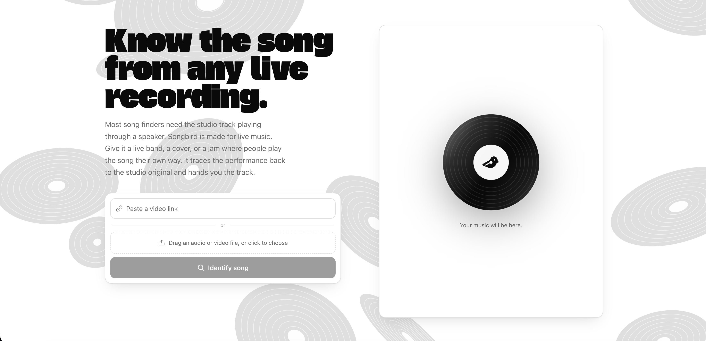

# Songbird



Songbird finds the studio original of a live recording. Give it an audio file, a
video file, or a link (YouTube, TikTok, SoundCloud, direct media). Songbird
returns one answer: the song name, the artist, and links to the studio version
on Apple Music, Spotify, and TikTok.

It finds the same song when the tempo, the key, the arrangement, or the
performance changes - even across a cover by a different band. It matches on
musical identity, not on an exact-audio fingerprint (it is not Shazam).

## How it works

```
audio / video file, or a URL
  → ffmpeg extracts audio from video/URLs; librosa reads it at 24 kHz mono
  → music-activity trim (drop spoken intros / silence, keep the music span)
  → split into 10 s windows, 5 s hop
  → MuQ makes a per-window embedding (CPU) → mean-pool over time → L2-normalize
  → FAISS IndexFlatIP (cosine) → per-window top-k, temperature-weighted vote
  → keep the most-confident ~⅓ of windows → sum votes across windows → recall set
  → chroma / chord-progression rerank (HPSS + CENS, orthogonal to timbre)
       fused with a precomputed catalog chroma store, gated against the MuQ recall set
  → single argmax → (song, artist, Apple URL)
  → Apple Music / Spotify / TikTok links
```

Two signals, deliberately orthogonal:

- **MuQ timbre retrieval** - frozen pretrained embeddings + kNN. Strong recall
  (the right song is almost always in the top few), but Top-1 is fragile at
  scale and can land on a sonically-adjacent wrong song.
- **Chroma / chord-progression rerank** - HPSS harmonic separation + CENS +
  transposition-invariant local alignment. Survives distortion and instrument
  changes, and IDs song identity across a different band. It's what promotes the
  correct song past a timbre-neighbour confuser.

No model training, no API keys. Frozen embeddings, kNN retrieval, and
performance-level aggregation.

## Setup

```
python3.13 -m venv .venv
.venv/bin/pip install -r requirements.txt
```

Install **ffmpeg** first (`brew install ffmpeg`). Songbird downloads MuQ
(`OpenMuQ/MuQ-large-msd-iter`, CC-BY-NC 4.0 — non-commercial) on first use. MuQ
runs on the CPU; the CPU path is slow but works.

For URL identification (YouTube, TikTok, SoundCloud), yt-dlp needs the
`curl_cffi` impersonation backend (in `requirements.txt`) and a current build.
TikTok and YouTube change often, so use the nightly:

```
.venv/bin/pip install -U --pre "yt-dlp[default]"
```

> YouTube note: some videos now require a PO token and will 403 on download.
> TikTok, SoundCloud, direct media links, and file uploads work. Adding a
> PO-token provider is the fix and is deferred.

## The reference catalog

Songbird matches against a catalog of studio tracks. The matcher defaults to
`data/catalog/` (FAISS index + row map + chroma fingerprint store); each row is
`[song, artist, apple_url]`.

**`data/` is gitignored, so a fresh clone has no catalog — you must build one
before the app can identify anything.** The catalog is derived from copyrighted
Apple Music / iTunes content and is not redistributed here. Building your own
took ~3,600 songs from Apple Music editorial playlists.

To build the catalog:

```
# 1. Studio embeddings → data/catalog/index.faiss + index_map.json
.venv/bin/python build_catalog.py --tracks path/to/Artist|Song.txt
#    (resumable: re-run to continue; --reset retries skips; --max=N caps)

# 2. Chroma fingerprints → data/catalog/chroma.pkl (used by the rerank fusion)
.venv/bin/python build_chroma.py
```

`build_catalog.py` resolves each track via the iTunes Search API and embeds the
30 s preview. `build_chroma.py` auto-discovers new songs from `index_map.json`.
Both are resumable via a manifest / checkpoints. Watch progress with
`scripts/progress.py`.

> iTunes rate-limit: the Search API hard-bans the IP after a burst. The builders
> pace requests (~4 s each) with exponential backoff; if you get banned, wait
> ~15–30 min before resuming.

### Bring your own reference songs

For a small hand-curated set instead of the catalog, put studio files in
`reference/`, list them in `reference/metadata.csv`:

```
filename,song,artist
so_what.mp3,So What,Miles Davis
```

then build a `data/` index:

```
.venv/bin/python build_reference.py
```

and point the matcher at it with `data_dir="data"`.

## Run it

Songbird runs as a localhost web app: paste a link or drop an audio/video file,
get one result card with Apple Music, Spotify, and TikTok links.

Backend (FastAPI), from the repo root:

```
.venv/bin/uvicorn server.app:app --port 8000
```

Frontend, in another terminal:

```
cd web && npm install && npm run dev
```

Open the Vite URL (http://localhost:5173). For a single process, build the
frontend and let the backend serve it:

```
cd web && npm run build      # → web/dist
# then open http://localhost:8000
```

### API

`POST /identify` (multipart; `url` wins over `file`):

```
curl -F url='https://www.tiktok.com/@user/video/...' localhost:8000/identify
curl -F file=@live.mp3 localhost:8000/identify
```

Returns exactly:

```json
{"song": "...", "artist": "...", "apple": "...", "spotify": "...", "tiktok": "..."}
```

`null` result → 422; fetch/decode errors → 400. The server caps queries at 90 s
and uses `recall_k=12`.

### Without the web layer

```
.venv/bin/python -c "from songbird.matcher import match; print(match('live.mp3'))"
```

## Deploy

Frontend and backend deploy separately — the backend is a heavy, stateful ML
service and does **not** fit serverless platforms.

**Frontend → Vercel** (config in `web/vercel.json`, root directory `web`). Set
env var **`VITE_API_BASE`** = your backend's URL. It's public — it ships in the
browser bundle, so it must be a URL, never a secret. See `web/.env.example`.

**Backend → Modal** (`deploy/modal_app.py`; no Dockerfile — the image is built
in Python). The MuQ model is baked into the image; the reference catalog lives
on a persistent Modal Volume.

```
pip install modal
modal token new                                  # authenticate (interactive)
modal volume create songbird-catalog
modal volume put songbird-catalog ./data/catalog /   # upload the ~86 MB catalog
modal deploy deploy/modal_app.py                 # prints the public web URL
```

Then set `VITE_API_BASE` on Vercel to the printed Modal URL and redeploy the
frontend. The backend reads two env vars (set in `modal_app.py`):
`SONGBIRD_CATALOG` (catalog path) and `SONGBIRD_ALLOWED_ORIGINS` (comma-separated
CORS allow-list — set to your Vercel domain, never `*`). Both default to the
local values when unset, so local runs are unaffected.

The public endpoint caps uploads at 30 MB and blocks non-http(s) / private-network
URLs (SSRF guard); `max_containers` in `modal_app.py` bounds cost under load. See
**Security & deploying publicly** for what's still deferred.

## Project layout

```
songbird/            core pipeline (importable, no side effects beyond MuQ load)
  audio.py           load / decode to 24 kHz mono (ffmpeg for video + URLs)
  activity.py        music-activity detection + trim (RMS, HPSS, chroma peakiness)
  windowing.py       10 s / 5 s windows
  embed.py           MuQ per-window embedding → mean-pool → L2-norm
  index.py           FAISS load; OpenMP thread cap (see note below)
  matcher.py         windowed vote + gated chroma-fusion → single answer
  rerank.py          chroma_cens / OTI / local alignment scoring
  chroma_index.py    precomputed chroma store + gated fuse()
  links.py           Apple / Spotify / TikTok search URLs
  projection.py      SupCon projection (NOT wired in — see Notes)
server/app.py        FastAPI /identify; serves web/dist; CORS for :5173
web/                 Vite + React 19 + TS + Tailwind v4 frontend
build_catalog.py     build/extend the studio embedding catalog (iTunes)
build_chroma.py      build/extend the chroma fingerprint store
build_reference.py   build a small index from reference/metadata.csv
scripts/             add_songs, bench_identify, fetch_playlists, progress
data/catalog/        prebuilt catalog: index.faiss, index_map.json, chroma.pkl
specs/               Spec Kit specs (001-songbird … 004-web-frontend)
```

## Self-checks

Each core module has an assert-based check:

```
.venv/bin/python -m songbird.audio
.venv/bin/python -m songbird.embed
.venv/bin/python -m songbird.windowing
.venv/bin/python -m songbird.index
.venv/bin/python -m songbird.matcher
.venv/bin/python -m songbird.chroma_index
.venv/bin/python -m songbird.links
```

Backend contract tests (run from the repo root):

```
.venv/bin/python -m pytest
```

(Use `-m pytest`, not bare `pytest` — the test does `import server.app` with no
`sys.path` setup at collection time.)

End-to-end benchmark on the known real queries:

```
.venv/bin/python scripts/bench_identify.py
```

## Notes

- **Single answer, always.** Exactly one song + links. No shortlist.
- **Accuracy tracks the paper's Top-1/Top-5 gap.** The correct song is almost
  always in the neighbourhood, and aggregation + chroma rerank push it toward
  rank 1 — but hard live/cover queries can still return a sonically-adjacent
  wrong answer. This is a hard problem; expect some misses.
- **OpenMP clash (macOS/arm), load-bearing:** torch and faiss-cpu each ship
  their own libomp. `songbird/__init__.py` sets `KMP_DUPLICATE_LIB_OK=TRUE` and
  `songbird/index.py` caps faiss to one thread. Import a `songbird` module
  (torch) *before* `import faiss` in any ad-hoc script, or the MuQ forward pass
  segfaults.
- **Supervised-contrastive projection (`projection.py`) is not used.** It was
  tested and made open-set retrieval worse at PoC scale (overfits, warps unseen
  songs). Raw MuQ has the correct ordering. `data/projection.pt` exists but is
  not wired into the pipeline. Revisit only with 100s–1000s of training songs.

## Security & deploying publicly

The public `/identify` endpoint ships with baseline guards:
- **Rate limit**: per-IP fixed window (`SONGBIRD_RATE_LIMIT` requests per
  `SONGBIRD_RATE_WINDOW` seconds, default 10/60s → 429 over that). In-memory per
  container; client IP is taken from `X-Forwarded-For`.
- **Upload cap**: 30 MB (413 over that).
- **SSRF guard** (`_check_public_url`): URL input must be `http(s)` and must not
  resolve to private/loopback/link-local ranges, checked before fetch.
- **CORS**: env-driven (`SONGBIRD_ALLOWED_ORIGINS`), defaulting to localhost —
  set it to your frontend domain in production, never `*`.
- On Modal, `max_containers` bounds the DoS/cost blast radius.

The rate limit is per-container (not global) and the SSRF guard checks the
user-supplied URL but not every redirect yt-dlp follows — fine for this scale;
add a shared store (Redis) and/or auth if traffic grows. No secrets are stored in
this repo; keep it that way.

## Licensing

- **Code**: see `LICENSE` (add one before publishing).
- **MuQ** (`OpenMuQ/MuQ-large-msd-iter`) is **CC-BY-NC 4.0 — non-commercial**.
  This makes the project a research/demo build, not a commercial one.
- **Catalog & reference audio** derive from copyrighted Apple Music / iTunes
  content and are **not** included in the repo. You build your own locally.

## Method

Method follows the *tip-of-my-ear* paper (Eser, ICML 2026 workshop),
findings-only — no paper code imported.
